# 🚀 Interview-AI: Intelligent Strategy & Mock Interview Platform

<p align="center">
  <em>An enterprise-grade, full-stack AI application designed to analyze resumes, generate tailored preparation roadmaps, and conduct live, voice-enabled technical mock interviews.</em>
</p>

<p align="center">
  <strong>Frontend Architecture</strong><br>
  
  
  <br><br>
  <strong>Backend & API</strong><br>
  
  
  <br><br>
  <strong>Database & Caching</strong><br>
  
  
  <br><br>
  <strong>AI & Security</strong><br>
  
  
</p>

---

## 🌐 Live Demo
🔗 **[Experience the Live Application Here](https://interview-ai-frontend-1ets.onrender.com)**

---

## 📸 Application Preview

### 🖥 The Command Center (Dashboard)
Upload your resume (PDF) and target job description. The AI parses the data to calculate match scores and skill gaps.
<p align="center">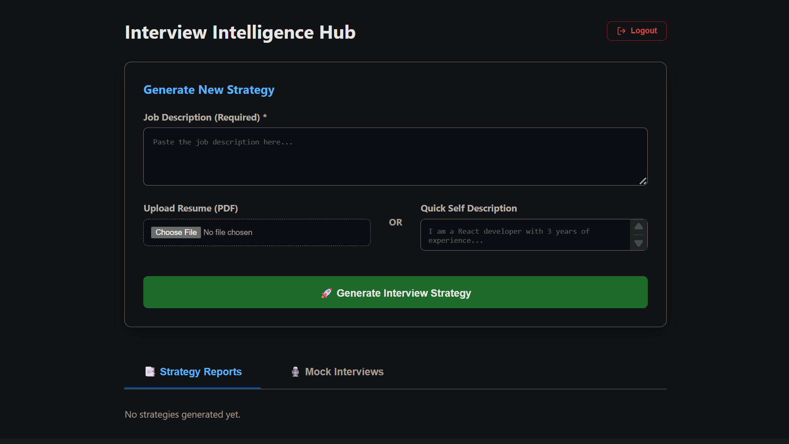</p>

### 🗺️ AI Strategy, Roadmap & Preparation Questions
Generates a highly tailored, interactive preparation roadmap based on your exact skill gaps. Includes customized technical and behavioural questions to guide your preparation.
<p align="center">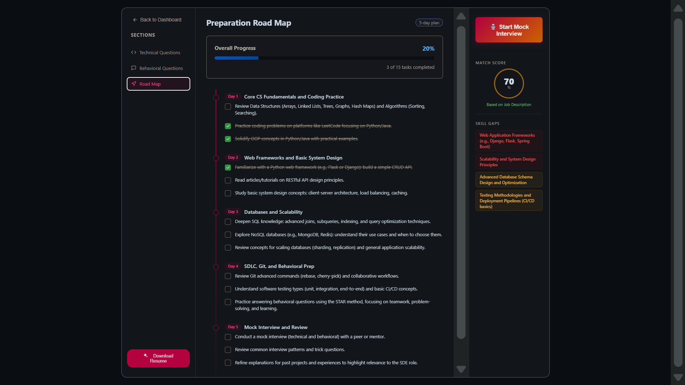</p>
<p align="center">
  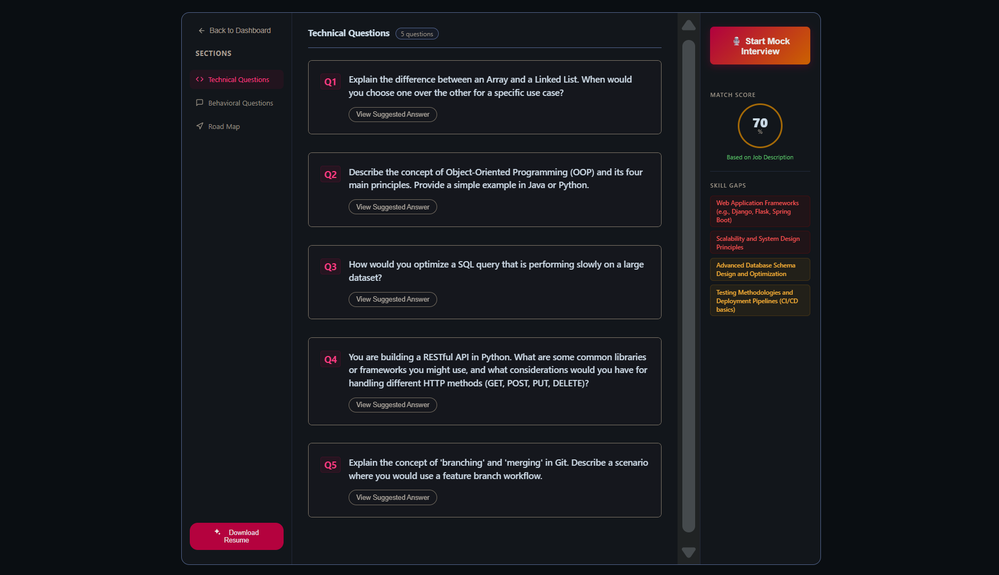
  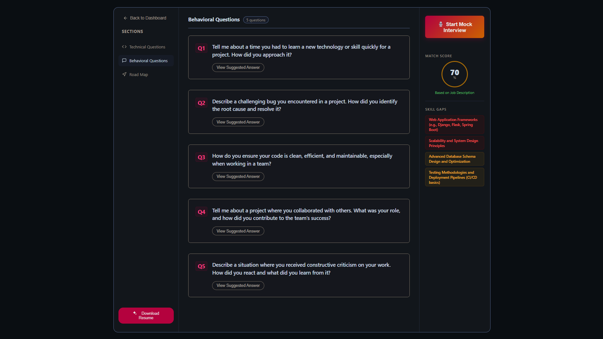
</p>

### 🎙️ Live AI Mock Interview Arena (Voice-Enabled)
Practice under pressure. The AI generates a custom mix of questions, reads them aloud using native Web Speech Synthesis, and allows you to dictate your answers seamlessly without touching your keyboard.
<p align="center">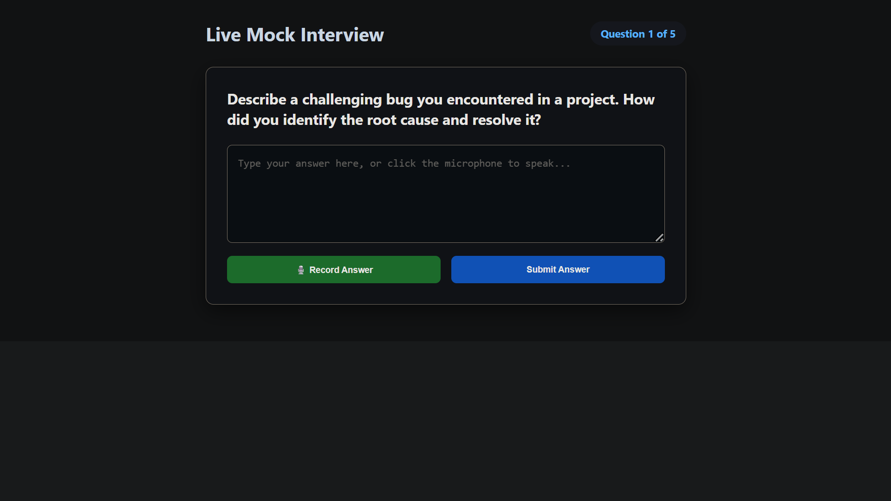</p>

### 📊 Instant AI Grading & Detailed Reports
Once the interview concludes, receive an instant grade (out of 10) on your verbal answers, complete with actionable feedback and a comprehensive scorecard.
<p align="center">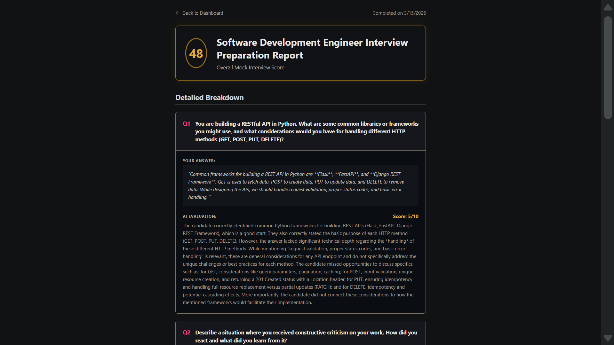</p>
<p align="center">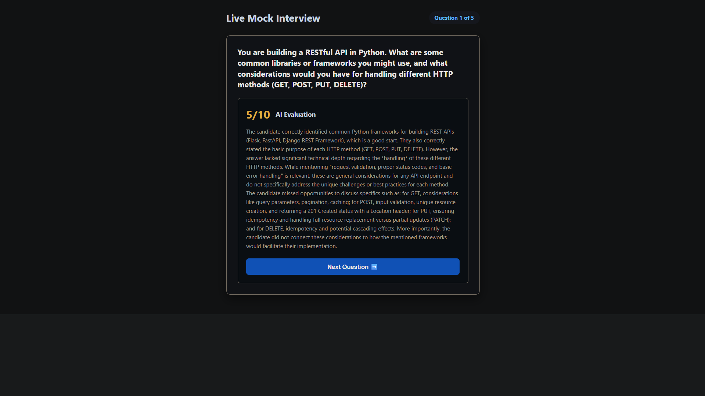</p>

### 📜 Persistent History
Track your progress over time. View all past mock interviews and generated strategies in one centralized location.
<p align="center">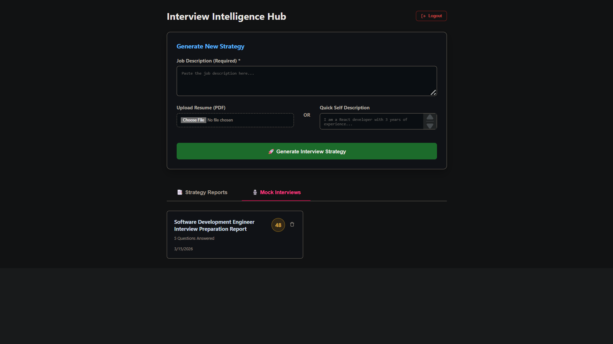</p>

---

## 🔐 Secure Authentication Architecture
Features a robust, stateless JWT authentication flow with an enterprise-grade password recovery system.

<p align="center">
  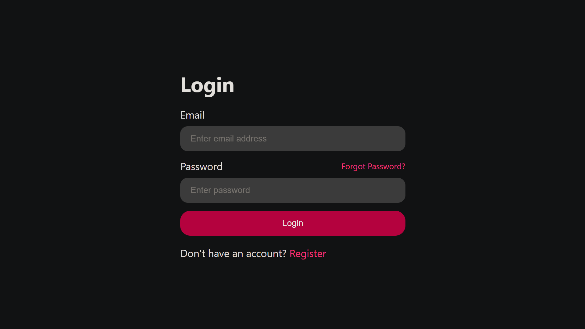
  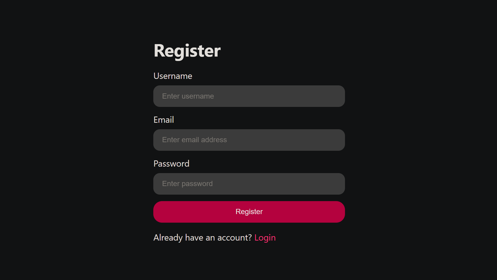
  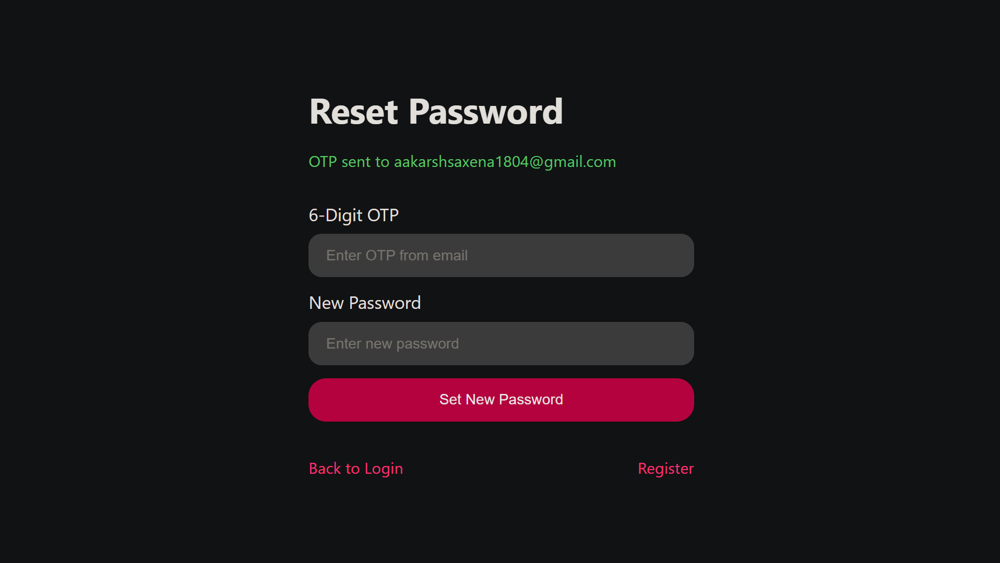
  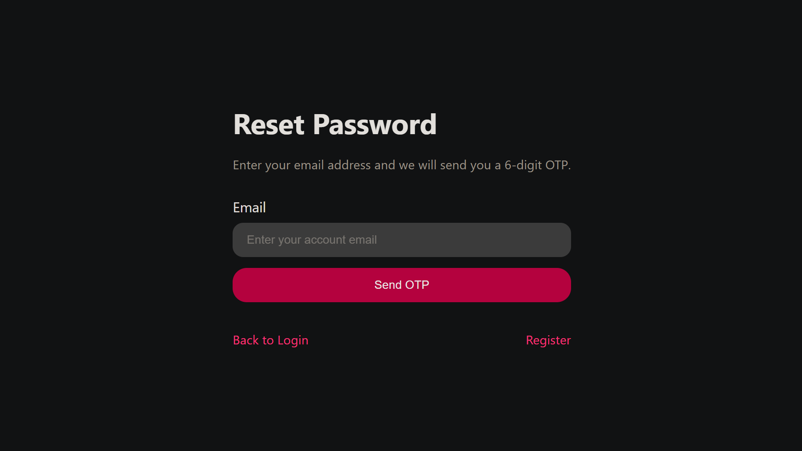
</p>

### 🔄 Advanced Password Reset Flow (Redis + Resend API)
1. User requests a password reset.
2. A cryptographic 6-digit OTP is generated and sent via **Resend HTTP API** (bypassing strict cloud SMTP firewalls).
3. The OTP is cached in **Redis** with a strict 5-minute Time-To-Live (TTL).
4. Backend verifies the user's input against the Redis cache in milliseconds.

---

## ✨ Core Features

* **🧠 Smart PDF Parsing:** Seamlessly handles user PDF uploads using `multer` (memory buffers) and extracts text using `pdf-parse`.
* **🗣️ Voice-Enabled Arena:** Utilizes the browser-native Web Speech API for seamless Text-to-Speech and Speech-to-Text interaction.
* **📄 Automated PDF Generation:** Uses `puppeteer` to dynamically render AI-generated strategies into downloadable PDFs.
* **⚖️ Stateless Mock Grading:** Conserves database writes by evaluating answers statelessly. Only final scorecards are committed to MongoDB.
* **🛡️ Bulletproof AI Normalization:** Custom sanitization layers strip unexpected Markdown formatting from the Gemini LLM, ensuring the database never crashes from malformed JSON.

---

## 🏗 System Architecture

```text
[ Frontend (React 19 + Vite) ] 
       │ (Axios + Credentials)
       ▼ 
[ Backend (Node.js + Express) ] ──▶ [ Redis ] (Fast OTP & Session TTL)
       │
       ├─▶ [ MongoDB ] (User Data & Interview Scorecards)
       │
       ├─▶ [ Resend API ] (Secure HTTP Email Delivery)
       │
       ├─▶ [ Puppeteer ] (Headless PDF Rendering)
       │
       ▼ 
[ Google Gemini 2.5 Flash SDK ] (Data Parsing, AI Strategy & Grading)

```

---

## 🛠 Tech Stack

* **Frontend:** React 19, Vite, React Router v7, Axios, SCSS, Web Speech API
* **Backend:** Node.js, Express.js
* **Database & Caching:** MongoDB, Mongoose, Redis
* **AI & Utilities:** Google Gen AI SDK (`gemini-2.5-flash`), Puppeteer, Multer, PDF-Parse
* **Security & Auth:** JWT (HTTP-Only Cookies), Bcrypt.js, Resend API

---

## 📂 Project Structure

```text
Interview-AI/
├── Frontend/
│   ├── public/
│   ├── src/
│   │   ├── App.jsx
│   │   ├── app.routes.jsx
│   │   ├── features/
│   │   ├── main.jsx
│   │   └── style/
│   ├── index.html
│   └── vite.config.js
├── backend/
│   ├── src/
│   │   ├── config/
│   │   ├── controllers/
│   │   ├── middlewares/
│   │   ├── models/
│   │   ├── routes/
│   │   ├── services/
│   │   └── utils/
│   ├── server.js
│   └── package.json
└── screenshots/
    ├── behavioural.png
    ├── history.png
    ├── home.png
    ├── login.png
    ├── mock-feedback.png
    ├── mock-interview.png
    ├── otp.png
    ├── register.png
    ├── report.png
    ├── reset.png
    ├── roadmap.png
    └── technical.png

```

---

## ⚙️ Local Installation & Setup

**Prerequisites:** Node.js (v18+), MongoDB (Local or Atlas), and Redis (running on port `6379`).

**1. Clone the repository**

```bash
git clone [https://github.com/Aakarsh2007/Interview-AI.git](https://github.com/Aakarsh2007/Interview-AI.git)

```

**2. Backend Setup**

```bash
cd backend
npm install

```

Create a `.env` file in the `backend` directory:

```env
PORT=3000
MONGODB_URI=mongodb://127.0.0.1:27017/interview_ai
REDIS_URL=redis://127.0.0.1:6379

JWT_SECRET=your_super_secret_jwt_string
ACCESS_TOKEN_SECRET=your_access_secret
REFRESH_TOKEN_SECRET=your_refresh_secret

GOOGLE_GENAI_API_KEY=your_google_gemini_api_key
RESEND_API_KEY=your_resend_api_key
FRONTEND_URL=http://localhost:5173

```

Start the backend server:

```bash
npm run dev

```

**3. Frontend Setup**
Open a new terminal window:

```bash
cd Frontend
npm install
npm run dev

```

Navigate to `http://localhost:5173` in your browser.

---

## 👨‍💻 Author

**Aakarsh Saxena** *Aspiring AI Engineer & Full Stack Developer* *B.Tech in Information Technology | IIIT Lucknow*

---

## ⭐ Support

If you found this project helpful or inspiring, please consider leaving a ⭐ on the repository!


