# 🚀 Interview-AI: Intelligent Strategy & Mock Interview Platform

<p align="center">
  <em>An enterprise-grade, full-stack AI application designed to analyze resumes, generate tailored preparation roadmaps, and conduct live, voice-enabled technical mock interviews.</em>
</p>

<p align="center">
  <strong>Frontend Architecture</strong><br>
  
  
  
  <br><br>
  <strong>Backend & API</strong><br>
  
  
  <br><br>
  <strong>Database & Caching</strong><br>
  
  
  <br><br>
  <strong>AI & Security</strong><br>
  
  
</p>

---

## 🌐 Live Demo
🔗 **[Experience the Live Application Here](https://interview-ai-frontend-1ets.onrender.com)**

---

## 📸 Application Preview

### 🖥 The Command Center (Dashboard)
Upload your resume (PDF) and target job description. The AI parses the data to calculate match scores and skill gaps.
<p align="center">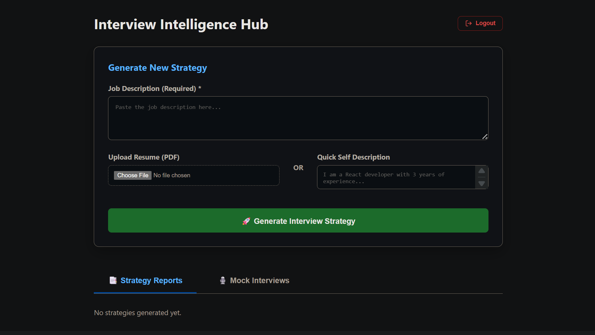</p>

### 🗺️ AI Strategy, Roadmap & Preparation Questions
Generates a highly tailored, interactive preparation roadmap based on your exact skill gaps. Includes customized technical and behavioural questions to guide your preparation.
<p align="center">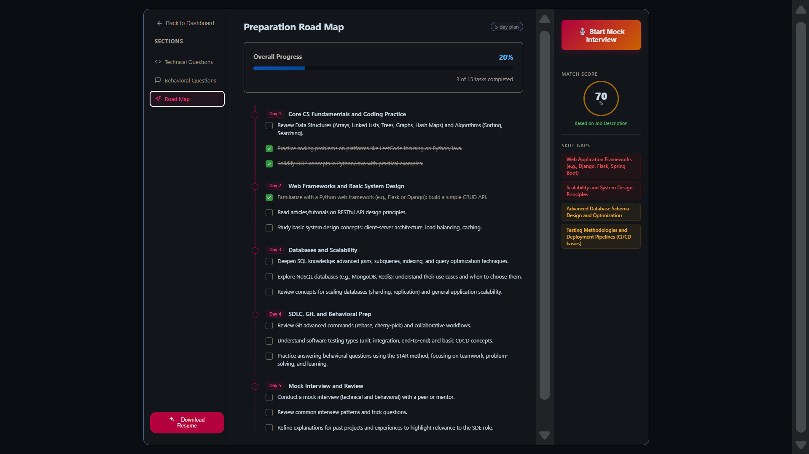</p>
<p align="center">
  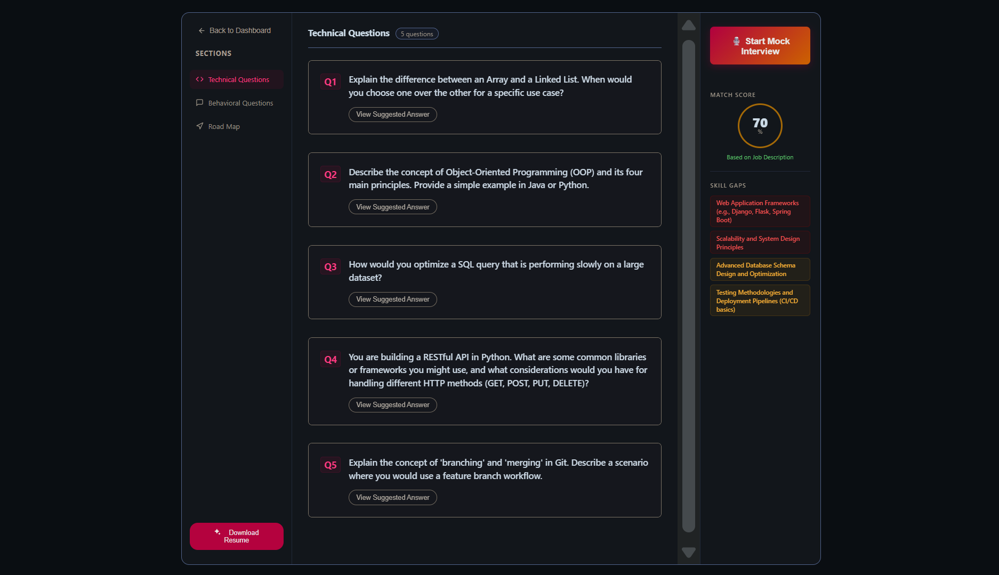
  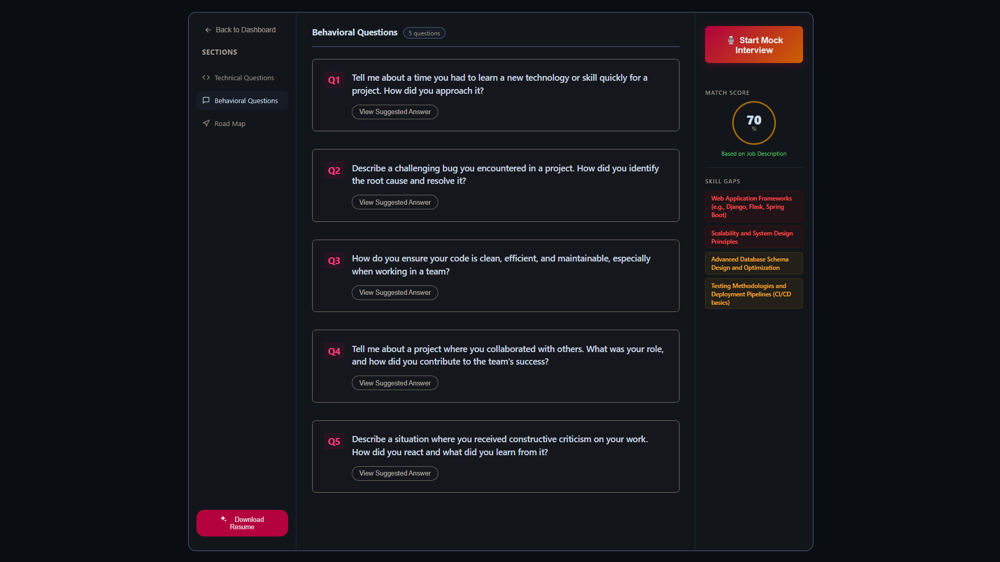
</p>

### 🎙️ Live AI Mock Interview Arena (Voice-Enabled)
Practice under pressure. The AI generates a custom mix of questions, reads them aloud using native Web Speech Synthesis, and allows you to dictate your answers seamlessly without touching your keyboard.
<p align="center">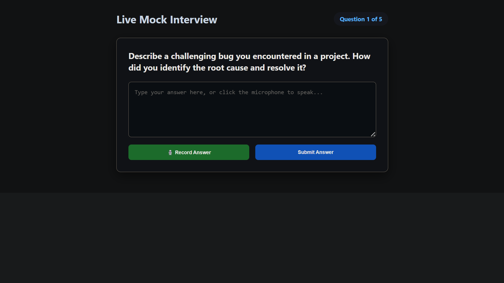</p>

### 📊 Instant AI Grading & Detailed Reports
Once the interview concludes, receive an instant grade (out of 10) on your verbal answers, complete with actionable feedback and a comprehensive scorecard.
<p align="center">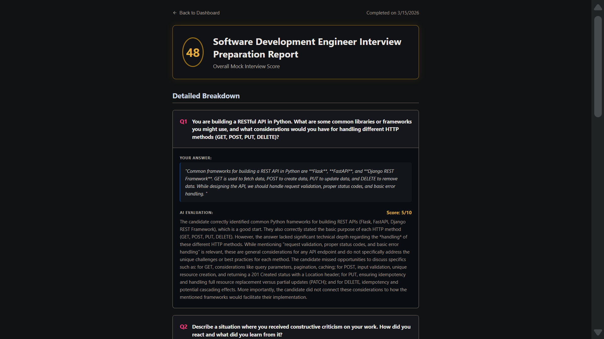</p>
<p align="center">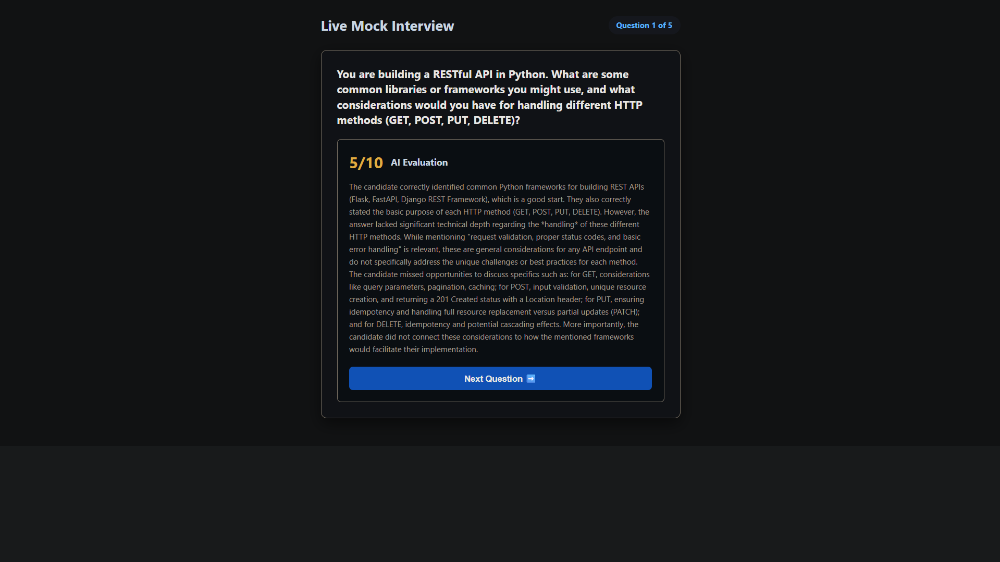</p>

### 📜 Persistent History & SVG Analytics
Track your progress over time. View all past mock interviews and generated strategies, alongside custom performance metrics charted dynamically using SVGs.
<p align="center">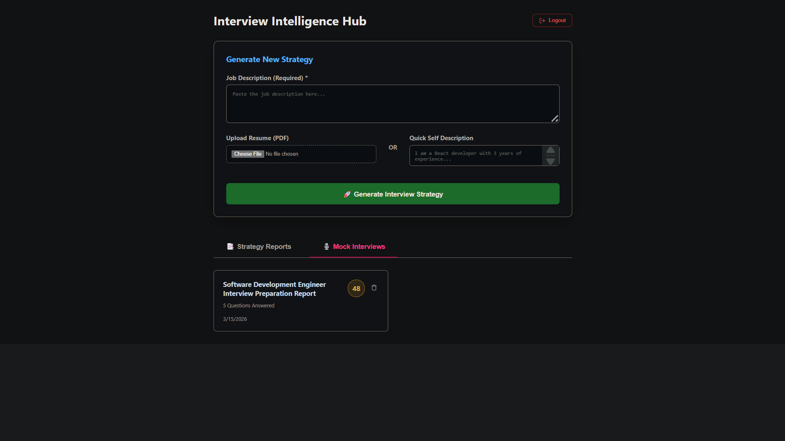</p>

---

## 🔐 Secure Authentication Architecture
Features a robust, stateless JWT authentication flow with an enterprise-grade password recovery system.

<p align="center">
  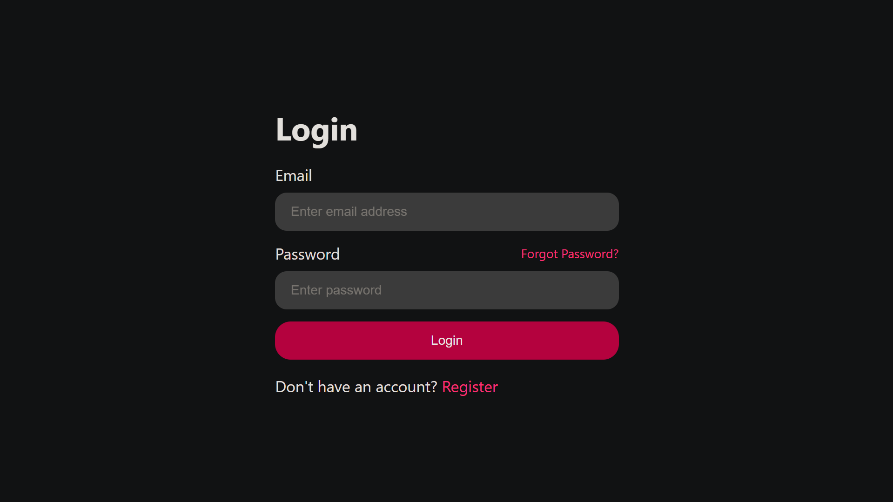
  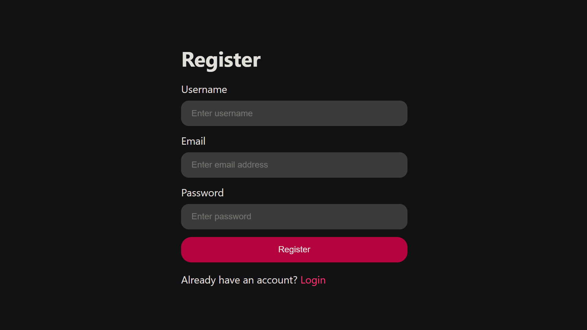
  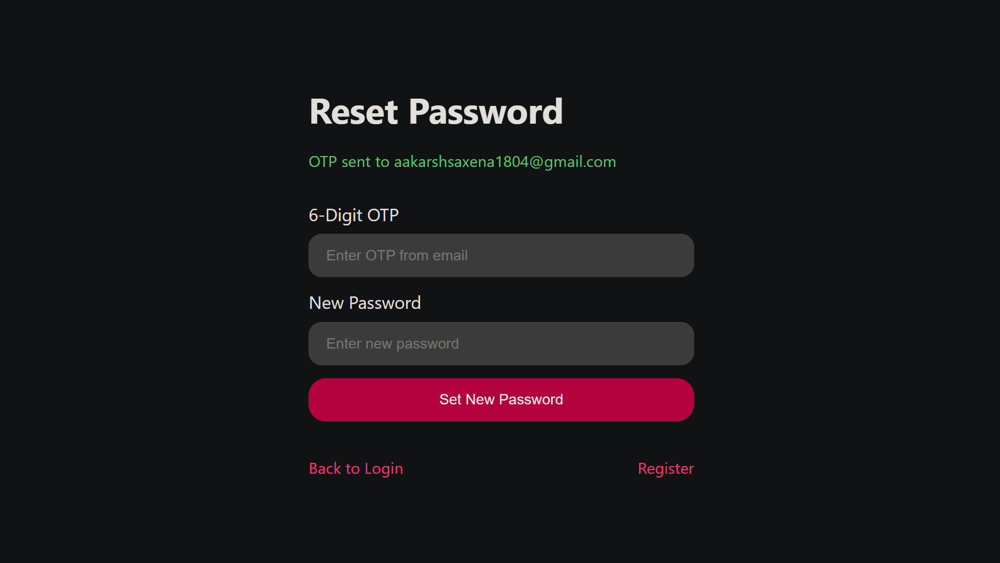
  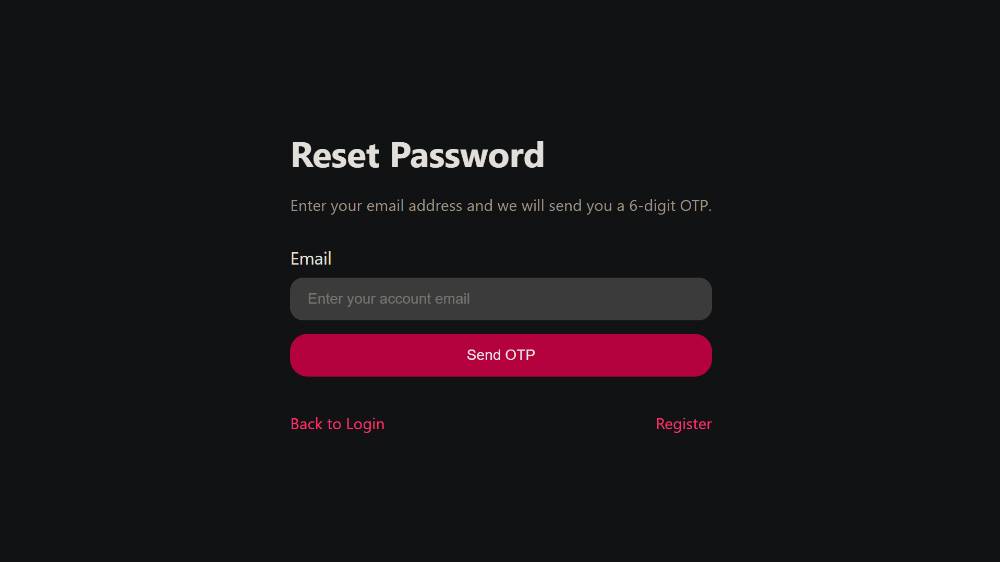
</p>

### 🔄 Advanced Password Reset Flow (Redis + Resend API)
1. User requests a password reset.
2. A cryptographic 6-digit OTP is generated and sent via **Resend HTTP API** (bypassing strict cloud SMTP firewalls).
3. The OTP is cached in **Redis** with a strict 5-minute Time-To-Live (TTL).
4. Backend verifies the user's input against the Redis cache in milliseconds.

---

## ✨ Standout Elite Features

* **🛡️ TypeScript Migration:** Full transition to TypeScript in the frontend for robust compilation and type-safety across API payloads, context states, and component bindings.
* **🎯 ATS Resume Optimizer:** Evaluates Job Descriptions against your resume to list missing keywords and generate targeted, copy-ready accomplishment bullets based on Google's X-Y-Z formula.
* **📈 Speech Pacing & Delivery Analytics:** Computes live spoken Words Per Minute (WPM) and detects speech filler words ("um", "like", "actually") during the interview dictation.
* **🎓 Roadmap Contextual Resources:** Integrates direct learning resources (YouTube search query links, official documentation, practice challenges) mapped to each skill roadmap task.
* **🗣️ Voice-Enabled Arena:** Utilizes the browser-native Web Speech API for seamless Text-to-Speech and Speech-to-Text interaction.
* **📄 Automated PDF Generation:** Uses `puppeteer` to dynamically render AI-generated strategies into downloadable PDFs.

---

## 🏗 System Architecture

```text
[ Frontend (React 19 + TypeScript + Vite) ] 
       │ (Axios + Credentials)
       ▼ 
[ Backend (Node.js + Express) ] ──▶ [ Redis ] (Fast OTP & Session TTL)
       │
       ├─▶ [ MongoDB ] (User Data & Interview Scorecards)
       │
       ├─▶ [ Resend API ] (Secure HTTP Email Delivery)
       │
       ├─▶ [ Puppeteer ] (Headless PDF Rendering)
       │
       ▼ 
[ Google Gemini 2.5 Flash SDK ] (Data Parsing, AI Strategy & Grading)

```

---

## 📂 Project Structure

```text
Interview-AI/
├── Frontend/
│   ├── public/
│   ├── src/
│   │   ├── App.tsx
│   │   ├── app.routes.tsx
│   │   ├── features/
│   │   │   ├── auth/
│   │   │   │   ├── auth.context.tsx
│   │   │   │   ├── services/auth.api.ts
│   │   │   │   └── pages/
│   │   │   └── interview/
│   │   │       ├── components/MockAnalytics.tsx
│   │   │       ├── hooks/useInterview.ts
│   │   │       ├── pages/Home.tsx
│   │   │       ├── pages/Interview.tsx
│   │   │       ├── pages/MockInterviewArena.tsx
│   │   │       ├── pages/MockInterviewResult.tsx
│   │   │       └── services/interview.api.ts
│   │   ├── main.tsx
│   │   └── style/
│   ├── index.html
│   ├── tsconfig.json
│   └── vite.config.js
├── backend/
│   ├── src/
│   │   ├── config/
│   │   ├── controllers/
│   │   ├── models/
│   │   ├── routes/
│   │   └── services/ai.service.js
│   ├── server.js
│   └── package.json
└── screenshots/
```

---

## ⚙️ Local Installation & Setup

**Prerequisites:** Node.js (v18+), MongoDB (Local or Atlas), and Redis (running on port `6379`).

**1. Clone the repository**
```bash
git clone https://github.com/Aakarsh2007/Interview-AI.git
```

**2. Backend Setup**
```bash
cd backend
npm install
```

Create a `.env` file in the `backend` directory:
```env
PORT=3000
MONGODB_URI=mongodb://127.0.0.1:27017/interview_ai
REDIS_URL=redis://127.0.0.1:6379

JWT_SECRET=your_super_secret_jwt_string
ACCESS_TOKEN_SECRET=your_access_secret
REFRESH_TOKEN_SECRET=your_refresh_secret

GOOGLE_GENAI_API_KEY=your_google_gemini_api_key
RESEND_API_KEY=your_resend_api_key
FRONTEND_URL=http://localhost:5173
```

Start the backend server:
```bash
npm run dev
```

**3. Frontend Setup**
Open a new terminal window:
```bash
cd Frontend
npm install
npm run dev
```
Navigate to `http://localhost:5173` in your browser.

---

## 🚀 Step-by-Step Production Deployment Guide

Deploying a multi-service setup requiring Redis caching and Puppeteer PDF generation needs careful environment and database setup. Here is how to configure it in production:

### 1. Database Provisioning
* **MongoDB**: Create a free cluster on [MongoDB Atlas](https://www.mongodb.com/cloud/atlas). Whitelist all connection IPs (`0.0.0.0/0`) and grab your connection string.
* **Redis**: Provision a secure serverless database on [Upstash Redis](https://upstash.com/). Copy the connection string (`rediss://...`).

### 2. Backend API Deployment (e.g., Render, Railway, or VPS)
Since the backend uses **Puppeteer** for PDF generation, standard hosting requires additional system libraries:
* **Option A: Railway (Recommended)**
  * Create a new project, link your GitHub repository, and select the `/backend` folder.
  * Railway will automatically run `npm start`.
  * Add env variables (see below).
* **Option B: Render**
  * Create a new **Web Service**, link your repository, and set the root directory to `backend`.
  * In **Settings**, under **Docker / Environment**, make sure you are using Node.js.
  * In the **Build Command**, use `npm install`.
  * Add the Puppeteer Chrome buildpack/dependencies if choosing custom OS stacks, or use a Dockerfile.
* **Backend Env Variables (Production)**:
  ```env
  PORT=10000
  MONGODB_URI=mongodb+srv://<username>:<password>@cluster0.mongodb.net/prod
  REDIS_URL=rediss://default:<password>@<upstash-endpoint>.upstash.io:6379
  JWT_SECRET=production_random_jwt_hash_string
  GOOGLE_GENAI_API_KEY=your_gemini_api_key
  RESEND_API_KEY=your_resend_api_key
  FRONTEND_URL=https://your-frontend-domain.vercel.app
  ```

### 3. Frontend Deployment (e.g., Vercel, Netlify, or Render Static Sites)
* **Vercel Setup**:
  * Connect your GitHub, select the repository, and set the Root Directory to `Frontend`.
  * Select the framework preset as **Vite**.
  * Add Environment Variable:
    * `VITE_API_BASE_URL` = `https://your-backend-api.onrender.com` (Point to your live backend endpoint).
  * Deploy. Vercel automatically compiles your TypeScript and hosts the static files on an edge CDN.

---

## 👨‍💻 Author

**Aakarsh Saxena**  
*Aspiring AI Engineer & Full Stack Developer*  
*B.Tech in Information Technology | IIIT Lucknow*

---

## ⭐ Support

If you found this project helpful or inspiring, please consider leaving a ⭐ on the repository!
